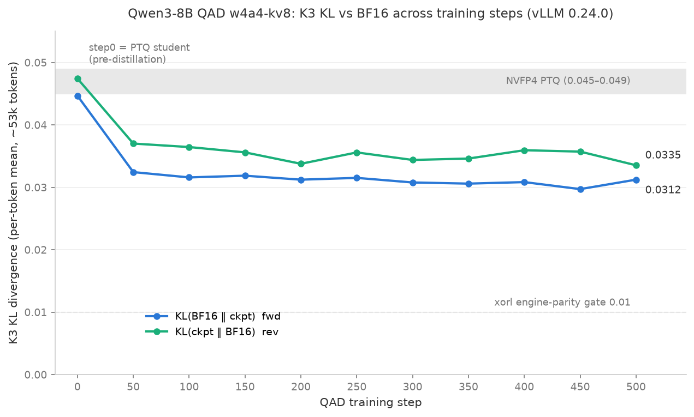
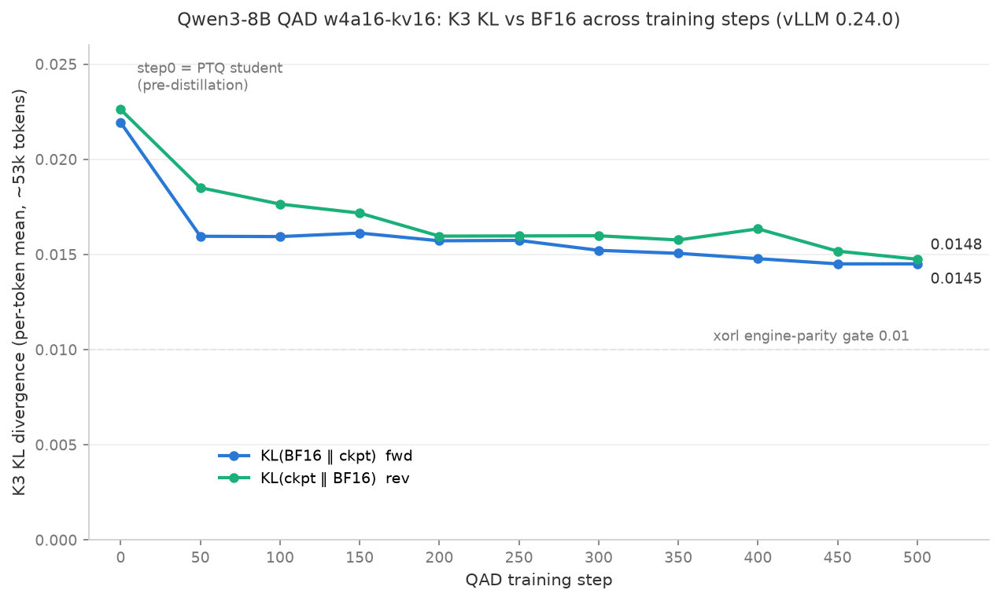
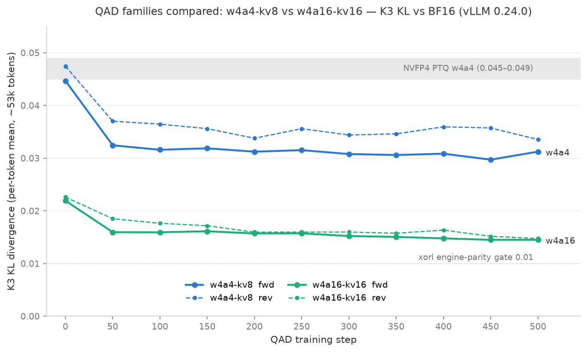

# 011 — QAD checkpoint sweep：w4a4-kv8 与 w4a16-kv16 两家族的 K3 KL vs 训练步数曲线（step0–500）

- **日期：** 2026-07-03（w4a4 部分原为 010，已并入本文）
- **目标：** 对两个 QAD 家族的全部训练 checkpoint（step0 = 蒸馏前量化 student，加 step50–step500 每 50 步一档，各 11 个）逐一测 K3 KL（相对 BF16 teacher），画出 KL 随训练步数的曲线，并做家族间对比。
  - w4a4-kv8：step0 = `togethercomputer/Qwen3-8B-modelopt-qad-quantized-student-w4a4-kvfp8-exported`，step50–500 = `togethercomputer/Qwen3-8B-modelopt-qad-w4a4-kv8-exported`
  - w4a16-kv16：step0 = `togethercomputer/Qwen3-8B-modelopt-qad-quantized-student-w4a16-kv16-exported`，step50–500 = `togethercomputer/Qwen3-8B-modelopt-qad-w4a16-kv16-exported`
- **机器 / 软件栈：** 与 007/008 相同——4x B200，**vLLM 0.24.0**（venv 含 `KVCacheScaleParameter` 补丁，见 008）。BF16 参考常驻一张卡（:8001）；各 checkpoint 在其余空闲卡轮流服务（w4a4 双通道 GPU0/GPU2，w4a16 因 GPU1/2 被其他实验占用改单通道 GPU0；全程精确 PID 清理）。
- **方法 / harness：** 与 007 完全一致（[`k3_cross_model_vllm.py`](k3_cross_model_vllm.py) + sweep 驱动 [`k3_step_sweep.py`](k3_step_sweep.py) + [`sweep_lane.sh`](sweep_lane.sh)）。正向（BF16‖ckpt）对**所有 checkpoint 复用同一份固定的 BF16 greedy 样本**（52 prompt × ≤1024 token ≈ 53k token），保证逐点、跨家族可比；反向（ckpt‖BF16）从各 checkpoint 现采样。
- **serving 差异：** w4a4 家族 `--kv-cache-dtype fp8`（按其 `hf_quant_config.json`）；w4a16 家族无 KV 量化，用默认 bf16 KV。
- **原始数据：** [`k3_sweep_results.json`](k3_sweep_results.json)（w4a4）、[`k3_sweep_w4a16.json`](k3_sweep_w4a16.json)（w4a16），均含每点 k1/k3 的 mean/median/p95/p99 与 gpqa/generic 拆分。
- **可复现性自证：** w4a4 step500 的 sweep 测量（0.0312/0.0335）与 007 的独立测量（0.0312/0.0334）完全一致。

## ⚠️ 重要口径说明：两家族测的是不同的推理模式

- **w4a4 家族**是真 NVFP4 w4a4 推理：vLLM `quant_algo=NVFP4` + fp4_gemm kernel，激活按 checkpoint 自带的
  `input_scale`（QAD 学到的）动态量化到 FP4，KV FP8。
- **w4a16 家族**是 weight-only 推理：vLLM `W4A16_NVFP4` 走 Marlin kernel，激活全程 BF16；且该 export
  **没有 `input_scale`/KV scale**，物理上无法直接按 w4a4 服务。
- 因此家族对比是"训练配方 × 推理模式"的混合对比。"w4a16 KL 减半"是关于**推理模式**的正确陈述；
  但若 w4a16 student 的部署意图是最终跑 w4a4 推理（如 009 中 VeOmni-w4 的事后校准路线），本文 w4a16
  曲线是部署 KL 的**下界**。公平的同部署模式配方对比需要先给 w4a16 checkpoint 事后校准激活 scale
  （ModelOpt/tore-quant），再按 w4a4 服务重测。

## 曲线

w4a4-kv8 家族：

w4a16-kv16 家族：

两家族对比：

## 数据

fwd = KL(BF16‖ckpt)，rev = KL(ckpt‖BF16)：

| step | w4a4 fwd | w4a4 rev | w4a16 fwd | w4a16 rev |
| --- | --- | --- | --- | --- |
| **0**（蒸馏前 PTQ student） | **0.04468** | **0.04743** | **0.02193** | **0.02261** |
| 50 | 0.03244 | 0.03702 | 0.01596 | 0.01851 |
| 100 | 0.03159 | 0.03646 | 0.01594 | 0.01765 |
| 150 | 0.03187 | 0.03560 | 0.01613 | 0.01718 |
| 200 | 0.03123 | 0.03378 | 0.01572 | 0.01596 |
| 250 | 0.03152 | 0.03560 | 0.01574 | 0.01598 |
| 300 | 0.03079 | 0.03439 | 0.01522 | 0.01598 |
| 350 | 0.03060 | 0.03462 | 0.01506 | 0.01576 |
| 400 | 0.03084 | 0.03595 | 0.01478 | 0.01635 |
| 450 | 0.02972 | 0.03573 | 0.01451 | 0.01517 |
| 500 | 0.03124 | 0.03354 | 0.01451 | 0.01475 |

参考线：NVFP4 纯 PTQ（nvidia 官方 checkpoint，w4a4 推理）同口径 K3 = 0.045–0.049（007）；xorl 引擎一致性 gate = 0.01；harness 噪声底 ≈ 0.0003。

## 发现

1. **step0 验证了各自的 PTQ 起点**：w4a4 student 实测 0.0447/0.0474，恰落在 nvidia 官方 NVFP4 PTQ 参考带
   （0.045–0.049）内——同为 PTQ、K3 相同，交叉验证了 harness；w4a16 student 起点 0.0219/0.0226，只有
   w4a4 的一半——在各自推理模式下，量化损伤约一半来自激活 4-bit（见上文口径说明）。
2. **两家族曲线形状完全同构："一步下台阶 + 长平台"。** w4a4 从 0.045 → step50 的 0.032（~90% 收敛在前
   50 步）；w4a16 从 0.022 → step50 的 0.016（~70%）。**QAD 的"前 50 步定乾坤"规律跨配方成立**，此后
   450 步均只有缓慢边际改善（w4a4 每 100 步约 −0.0005，w4a16 约 −0.0003）。
3. **平台高度成比例：** w4a16 平台（0.0145–0.0160）≈ w4a4 平台（0.030–0.032）的一半，与两者 PTQ 起点
   的比值一致（≈2×）——QAD 在两种配方上的相对收益相同（都压掉起点的 ~30%），剩余 KL 由量化/推理配置
   本身决定。
4. **双向全程对称**（rev/fwd ≈ 1.0–1.16，w4a16 随训练收敛到 1.02），22 个 checkpoint 无一出现
   007-sglang 时代那种伪"退化不对称"——所有 export 在 vLLM 下 serving 正常。
5. **对 RL gate 的读法：** w4a16 step500 的 K3 = 0.0145，距 0.01 的引擎一致性 gate 只差 45%，是目前所有
   量化 checkpoint 里最接近"可当 rollout 引擎"的；w4a4 平台（0.031）还差 3 倍。
6. **对训练的含义：** 以 K3 论，两个配方 step50 之后继续蒸馏的收益都很小；结合 004（w4a4 step500 GPQA
   0.5808 追平 bf16），值得用 GPQA 等下游指标抽测早期 checkpoint（step50/100/200）确认下游能力是否同样
   早饱和——K3 平不代表能力一定平（K3 测分布贴近度，不是能力）。
7. 全部 22 个 checkpoint 的服务与测量零失败（w4a4 双通道 ~55 分钟；w4a16 单通道 ~75 分钟）。

## 运维备注

- sweep 框架参数化：模型目录（`SWEEP_BASE`）、KV 参数（`SWEEP_KV_ARGS`）、输出文件（`K3_SWEEP_OUT`）；
  step0 用符号链接并入统一目录结构，跑完移除。每 checkpoint：起服务 → 测 → **按精确 PID 杀**；
  fp4_gemm autotune 因 `FLASHINFER_WORKSPACE_BASE` 缓存命中，每个 server 起动仅约 4–6 分钟。
- 两家族 export 的 `tokenizer_config.json` 都带坏的 `extra_special_tokens` 字段（list 而非 dict，崩新版
  transformers），按 006/008 的方式本地修复、用后还原。
- 下载注意：一次 `hf download` 带 9 个 `--include` pattern 时 step50 被静默漏掉（64/72 文件），单独补一次
  即可；下载后按 `model.safetensors` + `hf_quant_config.json` 逐目录校验。
- w4a16 起跑时 GPU1 被其他实验占用导致 BF16 首次启动失败（Free memory 23GiB < 需求），改用 GPU3 后正常——
  多人共用机器先 `nvidia-smi` 查占用再选卡；他人实验全程未受影响。
- 清理：全部 server 已停，22 个 checkpoint 的 tokenizer_config 均已还原，GPU 已释放。
